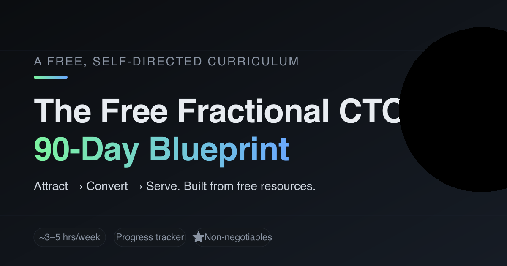

# 🧭 The Free Fractional CTO — 90-Day Blueprint

[](https://fcto-blueprint.netlify.app/)
[](./LICENSE)
[](#tech-notes)
[](#tech-notes)

> A self-directed curriculum that reproduces the CTOx **attract → convert → serve** arc using only free resources — with a built-in progress tracker.

**Live:** https://fcto-blueprint.netlify.app/



---

## Why this exists

The CTOx 90-Day Blueprint is a paid program that walks experienced tech leaders through becoming a fractional CTO. The *framework* is great; the *components* (books, blogs, podcasts, courses, networks) are almost all freely available on the open web.

This site stitches those free components into the same arc — **calibrate & position → package & attract → convert & serve** — so someone who already has the technical and business chops can self-direct the practice (positioning, packaging, pricing, selling, delivering) at the cost of their time, not $X,XXX.

It is **not** affiliated with CTOx. Every linked resource credits the original author/publisher.

## Features

- ✅ **32 curated items** across 11 phase-weeks (13 marked ⭐ as non-negotiable)
- ✅ **Per-item progress tracker** with sticky progress bar (`X / Y complete · N/M ⭐ done`)
- ✅ **Color-coded tags** — `Book` · `Blog` · `Podcast` · `Video` · `Course` · `Network`
- ✅ **Deliverables** called out per phase-week
- ✅ **Persistent state** via `localStorage` (no account, no backend, no cookies)
- ✅ **Mobile-friendly dark theme**, single HTML file, ~21 KB
- ✅ **Open Graph / Twitter Card** for clean link previews

## Curriculum structure

| Phase | Span | Weeks | Items | ⭐ |
| --- | --- | ---: | ---: | ---: |
| Set Up in Parallel | Day 1 | — | 5 | 2 |
| Phase 1 — Calibrate & Position | Days 1–30 | 1–4 | 8 | 5 |
| Phase 2 — Package & Attract | Days 31–60 | 5–8 | 8 | 4 |
| Phase 3 — Convert & Serve | Days 61–90 | 9–12 | 8 | 2 |
| Bonus — AI Differentiator | parallel | — | 3 | 0 |
| **Total** | | | **32** | **13** |

## Files

| File | Purpose |
| --- | --- |
| `index.html` | The curriculum site — single file, no build step, vanilla JS + CSS |
| `og-image.png` | 1200×630 social card (LinkedIn / X / Slack preview) |
| `og-image.svg` | Source for the social card |
| `playbook.html` | Long-form companion field manual (separate document) |
| `playbook-print.html` | Print-optimized variant of the playbook |
| `playbook.pdf` | Rendered PDF of the playbook |
| `netlify.toml` | Netlify config (no build; publish root + security headers) |

## Tech notes

- **No build step.** Open `index.html` directly or serve statically.
- **Zero runtime dependencies.** No frameworks, no CDN calls, no fonts loaded, no trackers.
- **No backend.** Progress lives in the visitor's browser via `localStorage` under the key `ctox-blueprint-v1`.
- **Bundle size:** ~21 KB HTML + ~87 KB PNG social card.
- **Browser support:** any modern browser (uses `localStorage`, CSS custom properties, and `accent-color` for the checkboxes).
- **Accessibility:** semantic landmarks (`header`, `section`, `footer`), `<label for>` pairing for every checkbox, 4.5:1+ contrast in the dark theme.

## Progress tracker

The tracker is intentionally tiny:

- One `<input type="checkbox">` per item; toggling it writes to `localStorage`.
- A sticky header recalculates `done / total` and `⭐ done / ⭐ total` on every change.
- A **Reset** button in the header clears the key after a `confirm()`.
- Storage key: `ctox-blueprint-v1` — bump the suffix if you ever change item IDs and want to invalidate old state.

To reset your own progress without the button:

```js
localStorage.removeItem('ctox-blueprint-v1')
```

## Local preview

```bash
python3 -m http.server 8000
# → http://localhost:8000
```

Or just `open index.html` — everything works on `file://` too.

## Deploy

The site is linked to Netlify; pushing to `main` auto-deploys.

Manual deploy from the CLI:

```bash
npx netlify-cli deploy --dir=. --prod
```

Drag-and-drop alternative: zip the repo and drop it onto https://app.netlify.com/drop.

## Editing the curriculum

All items live in the `data` object near the bottom of `index.html`. Each item:

```js
{ id: "uniqueId", star: true, tag: "blog", title: "…", url: "https://…", desc: "…" }
```

- `id` **must be stable** — it's the `localStorage` key. Changing it resets that item's checked state for every visitor.
- `tag`: one of `book | blog | podcast | video | course | network` (styled automatically).
- `star: true` marks a non-negotiable (⭐).
- New items appended to a phase array show up at the bottom of that week.

To add a new phase-week:

1. Add a `<div class="week">` block inside the right `<section class="phase">` with a fresh `<ul class="items" id="list-XYZ"></ul>`.
2. Add `XYZ: [ … ]` to the `data` object.
3. The render loop (`Object.keys(data).forEach`) picks it up automatically.

## Updating the social card

```bash
# edit og-image.svg, then:
rsvg-convert -w 1200 -h 630 og-image.svg -o og-image.png
git add og-image.* && git commit -m "tweak social card" && git push
```

After re-deploy, flush previews:

- LinkedIn → https://www.linkedin.com/post-inspector/
- Meta → https://developers.facebook.com/tools/debug/
- X → https://cards-dev.twitter.com/validator

## Roadmap / ideas

- [ ] Optional URL-hash sharing of completed-items state (so you can share progress without an account)
- [ ] Filter chips: show only ⭐, or only one tag, or only the current phase
- [ ] "Week N of 12" view toggle that hides everything except the active week
- [ ] Time-spent estimate per item, summed into "remaining hours"
- [ ] Export progress as JSON / Markdown
- [ ] Light-mode toggle

PRs and issues welcome.

## Credits

- Framework arc inspired by the **CTOx 90-Day Blueprint** (Lior Weinstein) — paid program at [ctox.com](https://ctox.com).
- Every linked resource is the work of its original author/publisher; this project just curates pointers.

## License

[MIT](./LICENSE) — do whatever; attribution appreciated.
